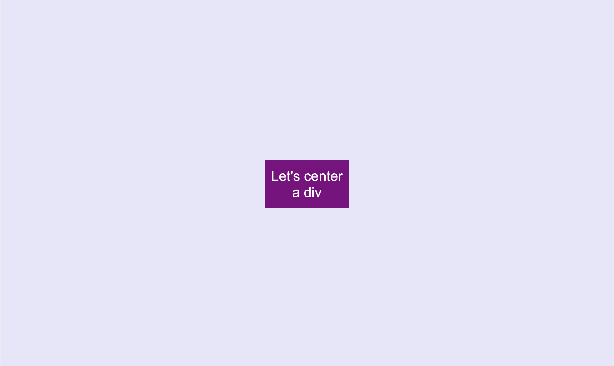
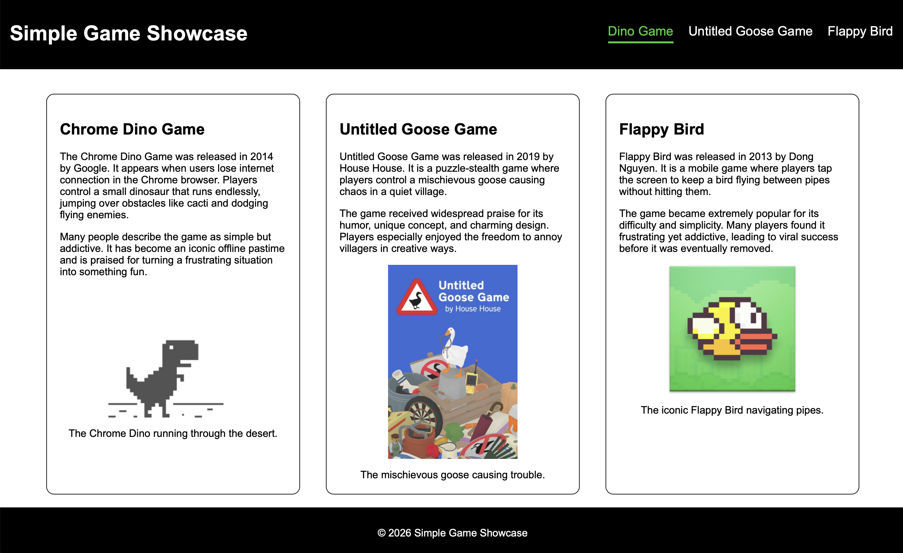
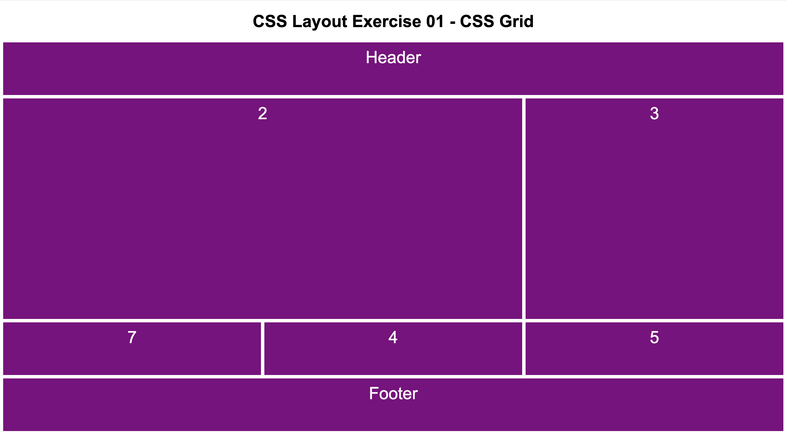
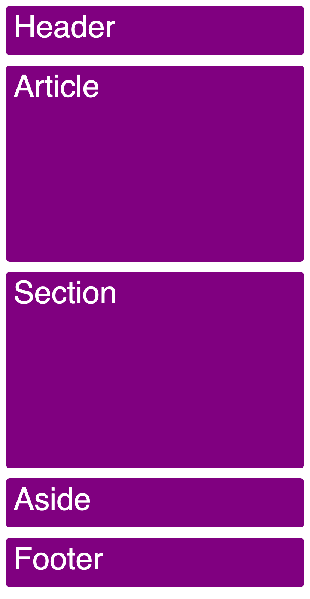
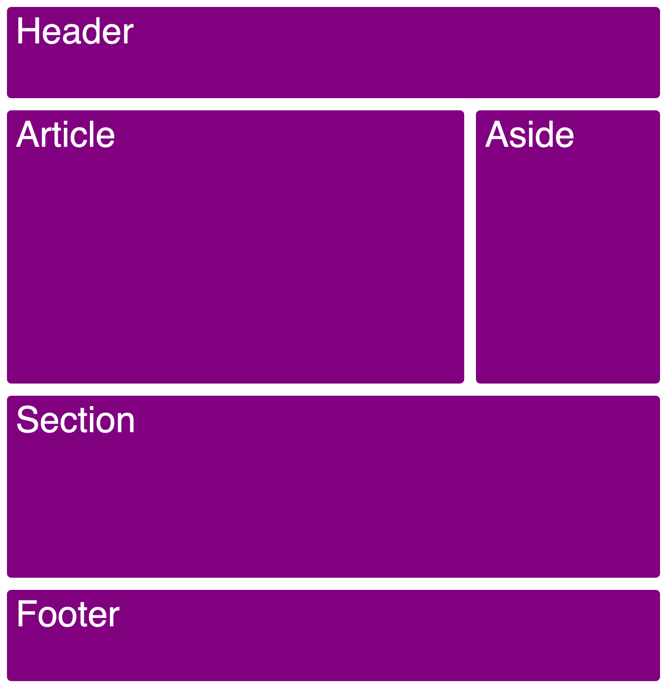
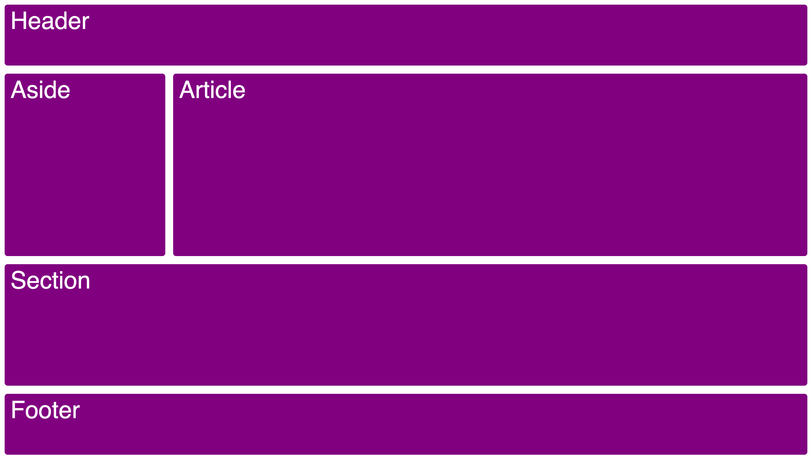

# CSS Layout

Exercises

- [Exercise 01 - Center](#ex01)
- [Exercise 02 - Flexbox](#ex02)
- [Exercise 03 - CSS Grid](#ex03)
- [Exercise 04 - CSS Grid Areas](#ex04)

##  Exercise 01 - Center

Vertically centering an element was a little tricky to implement prior to Flexbox. In this exercise, you will center a div horizontally and vertically. You also need to center the text inside the div.

All the CSS should be added to the `styles.css` file. The screenshot was taken in Firefox at a viewport width of 1024px.

##  Exercise 02 - Flexbox

Style the `semantics.html` page from `02-a11y` as shown in the screenshot below. All the CSS should be added to the `styles.css` file. Use `flexbox` to style the header, the navbar and the individual game sections. The screenshots were taken in Firefox at a viewport width of 1024px.

##  Exercise 03 - CSS Grid

Create the layout shown in the screenshot below using `CSS Grid`. All the CSS should be added to the `styles.css` file. The screenshots were taken in Firefox at a viewport width of 1024px.

##  Exercise 04 - CSS Grid Areas

Recreate the following layouts using `CSS Grid Areas`. The three screenshots are there to show a mobile layout, a tablet layout, and a laptop layout. Notice that one element is not there in all three layouts, and the layout changes based on the screen size. All the CSS should be added to the `styles.css` file.

The first screenshots were taken in Firefox at viewport widths of 414px (mobile), 768px (tablet), and 1024px (laptop screen).

