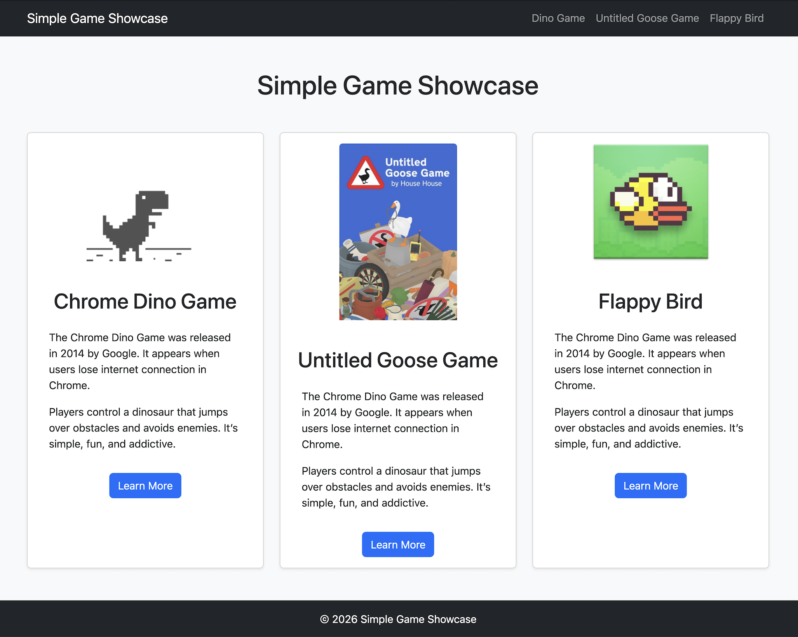
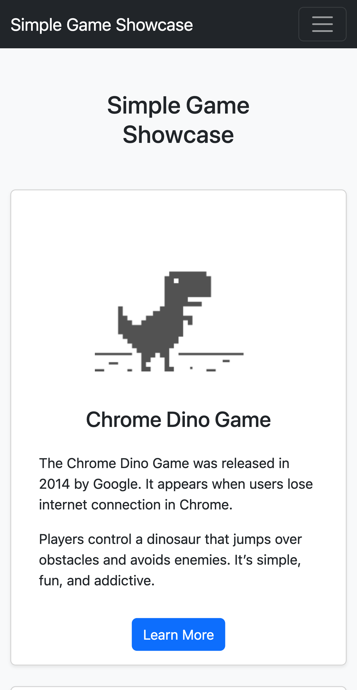
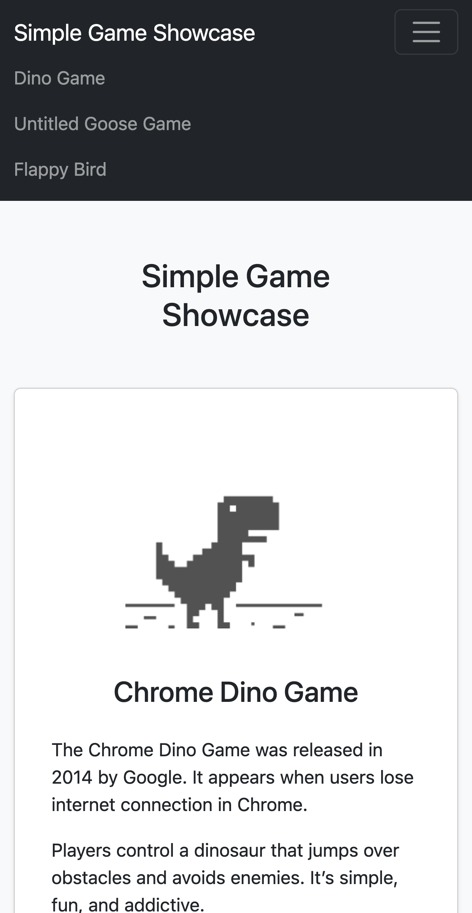
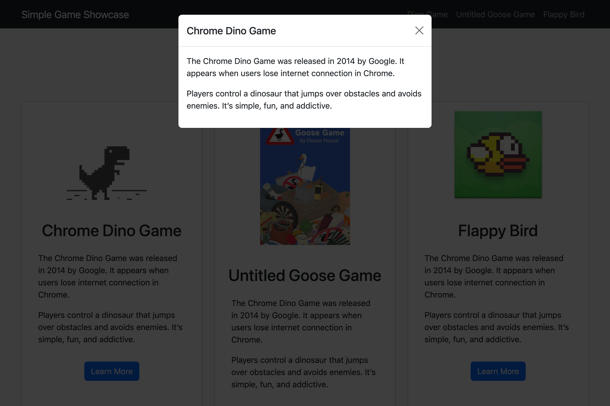
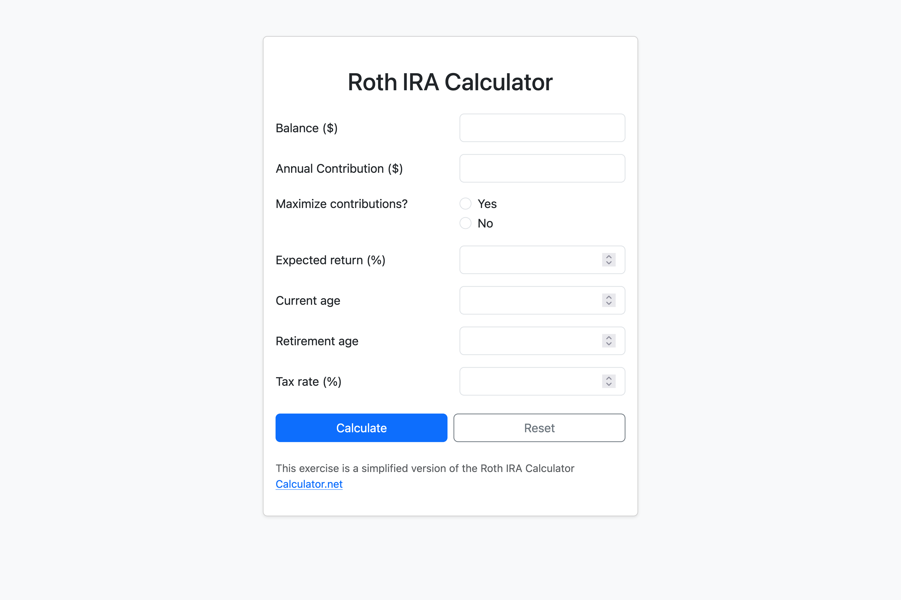
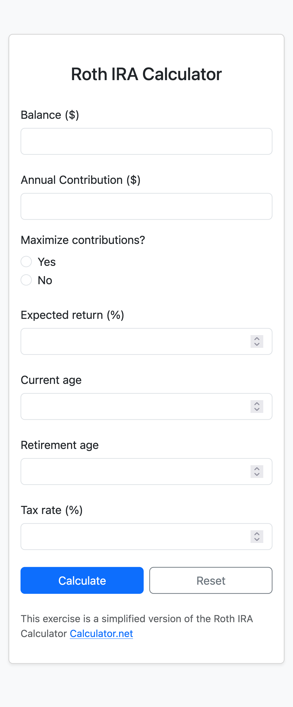

# Bootstrap Exercises

- [Exercise 01 - Cards](#ex01)
- [Exercise 02 - Form](#ex02)

##  Exercise 01 - Cards

Style the `cards.html` page as shown in the screenshots below using only Bootstrap. The screenshots were taken in Firefox at viewport widths of 1200px and 414px.

On the mobile view, make sure to implement the hamburger menu that expands only when clicked.

 

Whenever the user clicks on 'More info', use a modal to create a pop-up with some information about the game.

##  Exercise 02 - Form

Style the `form.html` page as shown in the screenshot below using only Bootstrap. The screenshots were taken in Firefox at viewport widths of 1200px and 414px.

Note that there is a change in layout between a larger screen and the mobile viewport.

