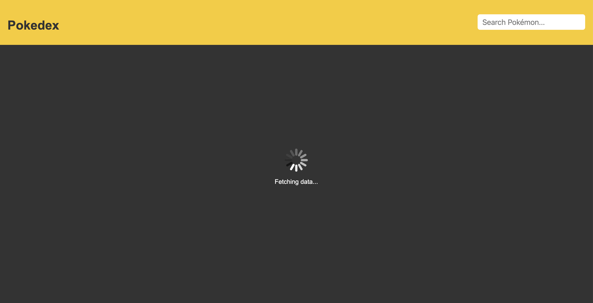
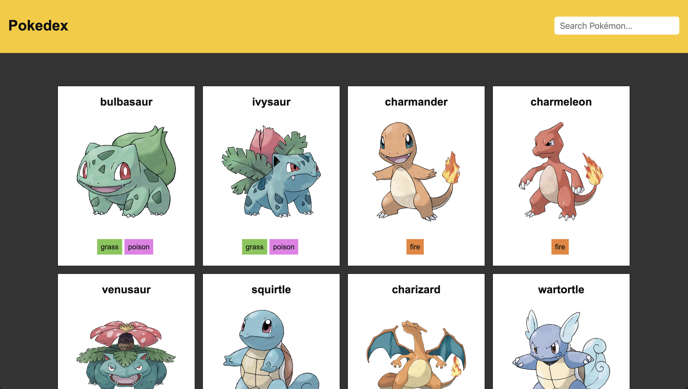
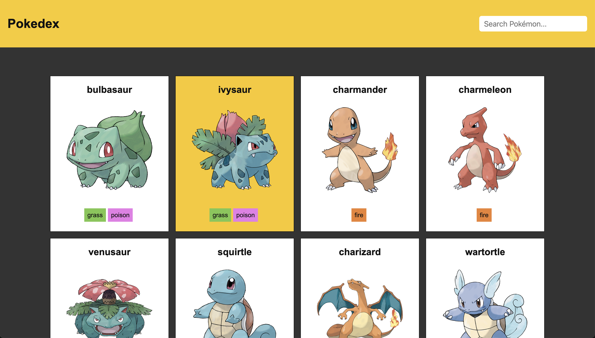

# JavaScript Exercises

- [Exercise 01 - Sort](#ex01)
- [Exercise 02 - Arrays](#ex02)
- [Exercise 03 - Age](#ex03)
- [Exercise 04 - Fetch](#ex04)

## <a id="ex01"></a> Exercise 01 - Sort

Use the function expression `sortPokemons` to sort the given list of Pokémons in numberical and alphabetic order, in ascending and descending order. Your function should output the sorted array to the console.

For example:

```javascript
console.log(sortPokemons('alphabetically, in ascending order'));
// [
//   { id: 15, name: 'Beedrill', types: ['Bug', 'Poison'] },
//   { id: 9, name: 'Blastoise', types: ['Water'] },
//   { id: 1, name: 'Bulbasaur', types: ['Grass', 'Poison'] },
//   { id: 12, name: 'Butterfree', types: ['Bug', 'Flying'] },
//   { id: 10, name: 'Caterpie', types: ['Bug'] },
//   { id: 6, name: 'Charizard', types: ['Fire', 'Flying'] },
//   { id: 4, name: 'Charmander', types: ['Fire'] },
//   { id: 5, name: 'Charmeleon', types: ['Fire'] },
//   { id: 2, name: 'Ivysaur', types: ['Grass', 'Poison'] },
//   { id: 14, name: 'Kakuna', types: ['Bug', 'Poison'] },
//   { id: 11, name: 'Metapod', types: ['Bug'] },
//   { id: 18, name: 'Pidgeot', types: ['Normal', 'Flying'] },
//   { id: 17, name: 'Pidgeotto', types: ['Normal', 'Flying'] },
//   { id: 16, name: 'Pidgey', types: ['Normal', 'Flying'] },
//   { id: 20, name: 'Raticate', types: ['Normal'] },
//   { id: 19, name: 'Rattata', types: ['Normal'] },
//   { id: 7, name: 'Squirtle', types: ['Water'] },
//   { id: 3, name: 'Venusaur', types: ['Grass', 'Poison'] },
//   { id: 8, name: 'Wartortle', types: ['Water'] },
//   { id: 13, name: 'Weedle', types: ['Bug', 'Poison'] },
// ];
```

## <a id="ex02"></a> Exercise 02 - Arrays

Use the function expression `forEachPokemon` to return the list of Pokémons with their number and type(s) in the format shown. Use the array method `forEach()` and string interpolation to create the output. The output should be formatted as shown below.

```javascript
console.log(forEachPokemon());
// #1 Bulbasaur - Grass / Poison
// #2 Ivysaur - Grass / Poison
// #3 Venusaur - Grass / Poison
// #4 Charmander - Fire
// #5 Charmeleon - Fire
// #6 Charizard - Fire / Flying
// #7 Squirtle - Water
// #8 Wartortle - Water
// #9 Blastoise - Water
// #10 Caterpie - Bug
// #11 Metapod - Bug
// #12 Butterfree - Bug / Flying
// #13 Weedle - Bug / Poison
// #14 Kakuna - Bug / Poison
// #15 Beedrill - Bug / Poison
// #16 Pidgey - Normal / Flying
// #17 Pidgeotto - Normal / Flying
// #18 Pidgeot - Normal / Flying
// #19 Rattata - Normal
// #20 Raticate - Normal
```

Use the function expression `filterPokemons` to return an array of all the Pokémons of that type. The array should be sorted in alphabetical order. Use the array methods `filter()`, `sort()`, and `map()`. The output should be formatted as shown below.

```javascript
console.log(filterPokemons('Fire'));
// [ 'Charizard', 'Charmander', 'Charmeleon' ]
console.log(filterPokemons('Normal'));
// [ 'Pidgeot', 'Pidgeotto', 'Pidgey', 'Raticate', 'Rattata' ]
console.log(filterPokemons('Poison'));
// [ 'Beedrill', 'Bulbasaur', 'Ivysaur', 'Kakuna', 'Venusaur', 'Weedle' ]
```

Use the function expression `searchPokemons` to search based on the name of the Pokémon or its type. Use the array methods `filter()` and `includes()`. The search should be case-insensitive.

```javascript
console.log(searchPokemons('Wartortle'));
// [ { id: 8, name: 'Wartortle', types: [ 'Water' ] } ]
console.log(searchPokemons('pidgey'));
// [ { id: 16, name: 'Pidgey', types: [ 'Normal', 'Flying' ] } ]
console.log(searchPokemons('bug'));
// [
//   { id: 10, name: 'Caterpie', types: [ 'Bug' ] },
//   { id: 11, name: 'Metapod', types: [ 'Bug' ] },
//   { id: 12, name: 'Butterfree', types: [ 'Bug', 'Flying' ] },
//   { id: 13, name: 'Weedle', types: [ 'Bug', 'Poison' ] },
//   { id: 14, name: 'Kakuna', types: [ 'Bug', 'Poison' ] },
//   { id: 15, name: 'Beedrill', types: [ 'Bug', 'Poison' ] }
// ]
```

Use the function expression `reducePokemons` to return an object with the number of Pokémons of each type. Use the array method `reduce()`.

```javascript
console.log(reducePokemons);
// {
//   Grass: 3,
//   Poison: 6,
//   Fire: 3,
//   Flying: 5,
//   Water: 3,
//   Bug: 6,
//   Normal: 5
// }
```

## <a id="ex03"></a> Exercise 03 - Age

Use the function expression `calculateAge` to calculate someone's age. Below are some example of valid responses based on the given arguments.

Note: The calculations for this exercise were completed on May 18, 2026.

```javascript
console.log(calculateAge('2000-07-01'));
// You are 25 years old
console.log(calculateAge('1988-05-18'));
// You are 38 years old
console.log(calculateAge('2190-01-01'));
// Error: You cannot be less than zero years old.
console.log(calculateAge('1800-01-01'));
// Are you sure you are more than 100 years old?
console.log(calculateAge(someday));
// Error: Invalid date format
```

## <a id="ex04"></a> Exercise 04 - Fetch

Fetch the first 25 Pokémons in the PokéAPI and append them to the DOM. To append a Pokémon, create a card element that contains the name, image, and type(s). In the navbar, create a search box. Using JavaScript, add classes to center and style all the Pokemons in the container given.

When the user searches for a specific Pokémon, return the appropraite card(s); otherwise, let the user know that nothing matched their query.

Screenshot #1: The screenshot below shows the navbar and a loading gif, to let the user know we are fetching the data they are requesting.



Screenshot #2: The screenshot below shows how the cards for each Pokémon should be organized on the page and styled.



Screenshot #3: The screenshot below shows the behavior on hover for each Pokémon card.


